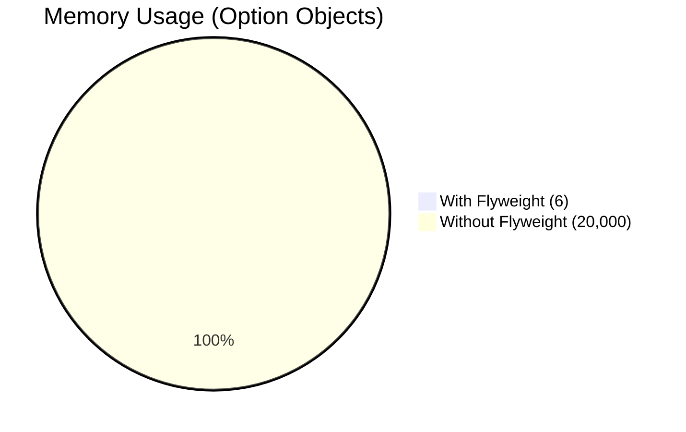

# 🧩 Structural Design Pattern
## 🔌 Adapter (Structural)

The **Adapter** pattern allows incompatible interfaces to work together by converting the interface of one class into an interface expected by the client. It's like a power plug adapter that lets a U.S. charger work in a European socket.

---

### ✅ When to Use

- You want to use an existing class but its interface doesn't match your needs.
- You want to create a reusable class that works with unrelated or legacy classes.
- You want to bridge **incompatible systems** without changing their code.

---

### 💡 Real-World Example

#### 🎧 Audio Player Adapter

```swift
protocol MediaPlayer {
    func play(filename: String)
}

class MP3Player: MediaPlayer {
    func play(filename: String) {
        print("🎵 Playing MP3 file: \(filename)")
    }
}

// Existing incompatible class
class VLCPlayer {
    func playVLC(file: String) {
        print("🎬 Playing VLC file: \(file)")
    }
}

// Adapter that makes VLCPlayer compatible
class VLCAdapter: MediaPlayer {
    private let vlcPlayer = VLCPlayer()
    
    func play(filename: String) {
        vlcPlayer.playVLC(file: filename)
    }
}
````

#### 🧪 Usage

```swift
let mp3 = MP3Player()
mp3.play(filename: "song.mp3")

let vlcAdapter = VLCAdapter()
vlcAdapter.play(filename: "movie.vlc")
```

---

### 🍎 iOS Built-in Usage

iOS uses the Adapter pattern in many places:

* **URLSession vs. Third-party Networking (like Alamofire)**
  You may create an adapter that converts `URLSession` calls to match a common protocol.

* **Bridging Swift with Objective-C classes**
  Swift automatically creates adapters (known as **bridging headers**) to allow compatibility.

* **UICollectionViewDiffableDataSource** adapts legacy data source logic into modern diffable models.

---

### 🧩 Summary

| Component | Role                                               |
| --------- | -------------------------------------------------- |
| `Target`  | The interface the client expects                   |
| `Adaptee` | The existing, incompatible interface               |
| `Adapter` | Translates `Adaptee` methods to `Target` interface |

> 🔌 The Adapter pattern promotes **code reusability** by allowing legacy or third-party code to be reused in modern systems without modification.

---

## 🌉 Bridge (Structural)

### 🧠 Intent

The **Bridge Pattern** decouples an abstraction from its implementation so that the two can vary independently. It's especially useful when you have multiple dimensions of variation in your system.

---

### 💡 Real-World Example: **Payment Gateway Integrations**

Suppose you're building an e-commerce app that needs to support:

* Multiple **payment types** (One-time, Subscription, Refunds, etc.)
* Multiple **payment gateways** (Stripe, PayPal, Razorpay)

Hard-coding all combinations leads to a mess.
With the Bridge pattern, we **separate the payment logic (abstraction)** from **gateway implementations**, keeping your system extensible and maintainable.

---

### 🧱 Structure

```swift
// MARK: - Implementation Interface
protocol PaymentGateway {
    func processPayment(amount: Double)
}

// MARK: - Concrete Implementations
class StripeGateway: PaymentGateway {
    func processPayment(amount: Double) {
        print("Processing ₹\(amount) via Stripe.")
    }
}

class PayPalGateway: PaymentGateway {
    func processPayment(amount: Double) {
        print("Processing ₹\(amount) via PayPal.")
    }
}

// MARK: - Abstraction
class Payment {
    let gateway: PaymentGateway

    init(gateway: PaymentGateway) {
        self.gateway = gateway
    }

    func makePayment(amount: Double) {
        gateway.processPayment(amount: amount)
    }
}

// MARK: - Refined Abstractions
class SubscriptionPayment: Payment {
    override func makePayment(amount: Double) {
        print("Handling subscription logic...")
        super.makePayment(amount: amount)
    }
}

class OneTimePayment: Payment {
    override func makePayment(amount: Double) {
        print("Handling one-time payment logic...")
        super.makePayment(amount: amount)
    }
}
```

---

### ✅ Usage

```swift
let stripe = StripeGateway()
let paypal = PayPalGateway()

let monthlySub = SubscriptionPayment(gateway: stripe)
monthlySub.makePayment(amount: 999.0)

// Output:
// Handling subscription logic...
// Processing ₹999.0 via Stripe.

let oneTime = OneTimePayment(gateway: paypal)
oneTime.makePayment(amount: 499.0)

// Output:
// Handling one-time payment logic...
// Processing ₹499.0 via PayPal.
```

---

### 🍎 iOS Usage Analogy

* `UIView` uses a `CALayer` underneath → a form of **bridge** between visual abstraction and rendering engine.
* `NSURLSession` is an abstraction that can delegate network behavior to different `URLProtocol` implementations.
* In SwiftUI, `View` is protocol-based but rendering is handled separately by the system — another subtle bridge.

Got it — here’s your **🌿 Composite Pattern** explanation in clean, GitHub-ready markdown.

---

## 🌿 Composite (Structural)

### 🧠 Definition:

The **Composite Pattern** lets you treat individual objects and compositions of objects uniformly. It’s perfect for representing **hierarchical, tree-like structures** where you want to work with both single items and groups in the same way.

---

### 🧾 Real-World Example:

**File System**

* A **File** is a single item.
* A **Folder** can contain files and other folders.
* Both `File` and `Folder` can be treated using the same operations like `getSize()`, `displayName()`, or `delete()`.

---

### 📱 iOS Real Example:

* **UIView hierarchy** in UIKit or **View** hierarchy in SwiftUI.
* `UIView` can be:

  * A leaf (e.g., `UILabel`, `UIImageView`)
  * A composite (e.g., `UIStackView` containing other views)
* Both respond to methods like `.addSubview()` and `.removeFromSuperview()`.

---

### 🧑‍💻 Swift Example:

```swift
// Component Protocol
protocol FileSystemItem {
    var name: String { get }
    func display(indentation: String)
}

// Leaf
struct File: FileSystemItem {
    let name: String
    func display(indentation: String) {
        print("\(indentation)📄 \(name)")
    }
}

// Composite
class Folder: FileSystemItem {
    let name: String
    private var items: [FileSystemItem] = []

    init(name: String) {
        self.name = name
    }

    func add(_ item: FileSystemItem) {
        items.append(item)
    }

    func display(indentation: String = "") {
        print("\(indentation)📂 \(name)")
        items.forEach { $0.display(indentation: indentation + "  ") }
    }
}

// Usage
let file1 = File(name: "Resume.pdf")
let file2 = File(name: "CoverLetter.pdf")
let docsFolder = Folder(name: "Documents")
docsFolder.add(file1)
docsFolder.add(file2)

let rootFolder = Folder(name: "Home")
rootFolder.add(docsFolder)
rootFolder.display()
```

**Output:**

```
📂 Home
  📂 Documents
    📄 Resume.pdf
    📄 CoverLetter.pdf
```

---

### 🧰 When to Use:

* Represent part-whole hierarchies.
* You want to treat individual objects and groups of objects uniformly.
* Common in **UI trees, graphics engines, DOM structures, file explorers**.

---
## 🎨 Decorator (Structural)
🧠 **Definition**
The Decorator Pattern allows you to add new behavior to an object dynamically without modifying its existing code.
It wraps the original object inside another object that adds the extra functionality — just like adding toppings to ice cream without changing the ice cream itself.
This provides a flexible alternative to using inheritance to modify behaviour
📱 iOS Real Example
* UIKit: NSAttributedString
    * Base text is wrapped with attributes like `.foregroundColor, .font, .underline`.
* SwiftUI: `.padding(), .background(), .shadow()`
    * These are decorators — they wrap your view and add behavior or appearance without altering the original view type.

Here are **Top 5 real-world & iOS relatable examples** for the **🍧 Decorator Pattern** you can choose from:

1. **📄 NSAttributedString Styling** – Base text with dynamic attributes (color, font, underline, background, kerning).
2. **☕ Coffee Ordering System** – Base drink with add-ons like milk, whipped cream, syrups, extra shots.
3. **🎨 SwiftUI View Modifiers** – Applying `.padding()`, `.background()`, `.shadow()` as chained decorators.
4. **🔒 Network Request Handling** – Wrapping API calls with decorators for logging, authentication, retry logic, caching.
5. **🎮 Game Character Power-ups** – Base character gets temporary abilities like shields, speed boosts, invisibility.


### 🎬 Decorator Pattern — Video Streaming Player (Scalable Example)

The **Decorator Pattern** is perfect for a streaming player: you keep a simple base player implementation and **attach features** (subtitles, watermark overlays, analytics, adaptive bitrate, etc.) at runtime — without changing the player itself. This yields a highly modular and scalable architecture: add/remove features independently, compose them in any order, and test each feature in isolation.

---

### 🧠 Concept
- **Core idea:** Wrap a `Player` with decorators that add behavior before/after (or around) the core `play()` / `stop()` / `seek()` operations.
- **Benefits:**  
  - Add features without modifying the core player.  
  - Compose features dynamically (e.g., analytics + subtitles).  
  - Avoid subclass explosion (no `PlayerWithSubtitlesAndAnalytics` combinatorial problem).

---

### 📦 Components
- `Player` protocol — the target interface.
- `BasicPlayer` — the concrete core player (plays video).
- `PlayerDecorator` — base decorator that forwards calls.
- Concrete decorators: `SubtitlesDecorator`, `WatermarkDecorator`, `AnalyticsDecorator`, `AdaptiveBitrateDecorator`.

---

### 💻 Swift Example

```swift
import Foundation
import CoreGraphics

// MARK: - Player Protocol (Component)
protocol Player {
    func play(url: URL)
    func stop()
    func seek(to seconds: Double)
}

// MARK: - Basic Player (Concrete Component)
class BasicPlayer: Player {
    func play(url: URL) {
        print("▶️ Playing video at \(url.absoluteString)")
        // actual playback logic (AVPlayer, etc.) goes here
    }

    func stop() {
        print("⏹ Stopped playback")
    }

    func seek(to seconds: Double) {
        print("⏱ Seek to \(seconds)s")
    }
}

// MARK: - Decorator Base
class PlayerDecorator: Player {
    private let wrapped: Player

    init(wrapping player: Player) {
        self.wrapped = player
    }

    func play(url: URL) {
        wrapped.play(url: url)
    }

    func stop() {
        wrapped.stop()
    }

    func seek(to seconds: Double) {
        wrapped.seek(to: seconds)
    }
}

// MARK: - Subtitles Decorator
class SubtitlesDecorator: PlayerDecorator {
    private let subtitleURL: URL

    init(wrapping player: Player, subtitleURL: URL) {
        self.subtitleURL = subtitleURL
        super.init(wrapping: player)
    }

    override func play(url: URL) {
        loadSubtitles()
        super.play(url: url)
    }

    private func loadSubtitles() {
        print("💬 Loading subtitles from \(subtitleURL.lastPathComponent)")
        // parse and attach subtitle rendering to player UI
    }
}

// MARK: - Watermark Decorator
class WatermarkDecorator: PlayerDecorator {
    private let watermarkText: String
    private let position: CGPoint

    init(wrapping player: Player, text: String, position: CGPoint = .init(x: 10, y: 10)) {
        self.watermarkText = text
        self.position = position
        super.init(wrapping: player)
    }

    override func play(url: URL) {
        addWatermark()
        super.play(url: url)
    }

    private func addWatermark() {
        print("🔖 Adding watermark '\(watermarkText)' at \(position)")
        // overlay watermark view on player layer
    }
}

// MARK: - Analytics Decorator
class AnalyticsDecorator: PlayerDecorator {
    override func play(url: URL) {
        trackEvent("play", url: url)
        super.play(url: url)
    }

    override func stop() {
        trackEvent("stop", url: nil)
        super.stop()
    }

    override func seek(to seconds: Double) {
        trackEvent("seek", url: nil, extra: ["position": seconds])
        super.seek(to: seconds)
    }

    private func trackEvent(_ name: String, url: URL?, extra: [String: Any]? = nil) {
        print("📊 Analytics - event: \(name), url: \(url?.lastPathComponent ?? "-"), extra: \(extra ?? [:])")
        // forward to analytics backend (batching, retries)
    }
}

// MARK: - Adaptive Bitrate Decorator
class AdaptiveBitrateDecorator: PlayerDecorator {
    override func play(url: URL) {
        selectInitialQuality()
        super.play(url: url)
        monitorNetworkAndAdapt()
    }

    private func selectInitialQuality() {
        print("⚙️ Selecting initial bitrate based on current conditions")
    }

    private func monitorNetworkAndAdapt() {
        print("⚙️ Monitoring network and adapting bitrate (simulated)")
        // In real app: observe bandwidth, switch streams or set AVPlayer item variants
    }
}
````

---

### 🧪 Usage Example

```swift
let url = URL(string: "https://cdn.example.com/movie.m3u8")!
let subtitleURL = URL(string: "https://cdn.example.com/movie.en.vtt")!

// Start with basic player
var player: Player = BasicPlayer()

// Dynamically compose decorators (order can matter: analytics wrapped outside will see all events)
player = SubtitlesDecorator(wrapping: player, subtitleURL: subtitleURL)
player = WatermarkDecorator(wrapping: player, text: "MyBrand")
player = AdaptiveBitrateDecorator(wrapping: player)
player = AnalyticsDecorator(wrapping: player)

// Use player
player.play(url: url)
player.seek(to: 120)
player.stop()
```

**Sample Console Output:**

```
💬 Loading subtitles from movie.en.vtt
🔖 Adding watermark 'MyBrand' at (10.0, 10.0)
⚙️ Selecting initial bitrate based on current conditions
📊 Analytics - event: play, url: movie.m3u8, extra: [:]
▶️ Playing video at https://cdn.example.com/movie.m3u8
📊 Analytics - event: seek, url: -, extra: ["position": 120]
⏹ Stopped playback
📊 Analytics - event: stop, url: -
```

---

### 🏗️ Scaling Tips & Notes

* **Order matters:** Decorator wrapping order affects behavior (e.g., analytics outermost captures all events).
* **Stateful decorators:** Keep decorators lightweight; if they need heavy state, consider dedicated services (e.g., analytics batching).
* **Testing:** Each decorator is independently testable — great for large teams & CI.
* **Performance:** Avoid heavy synchronous work in decorators (load subtitles asynchronously; overlay UI on main thread).
* **Integration with AVPlayer:** In a production app you'd wire decorators to real AVPlayer APIs, AVPlayerItem variant selection (for ABR), and UI overlays for subtitles/watermarks.

---

### ✅ Why Decorator fits video players

* New features (captions, DRM overlays, analytics, ABR) are frequently added — decorating keeps core playback untouched.
* Allows dynamic composition for different user tiers (e.g., premium users get watermark off, analytics on).
* Avoids explosion of specialized player subclasses.
  
🧰 When to Use
* You need to add behavior without altering the original class.
* You want flexibility to combine features at runtime.
* Common in UI modifications, stream processing, logging, and formatting
---
Here’s your **Façade pattern** explanation in the same scalable app style you liked:

---

## 🏛️ Façade (Structural)

**Definition:**
The **Façade pattern** provides a unified, simplified interface to a set of complex subsystems, making them easier to use without exposing the underlying complexity. It acts as a “front desk” that delegates requests to the appropriate backend services.

---

### 📱 **iOS Real Example** – Media Upload Manager

Imagine a **social media app** where users can upload videos with multiple processing steps:

* **Compression** (reduce file size)
* **Encoding** (convert to required format)
* **Thumbnail Generation**
* **Metadata Extraction** (duration, resolution, codec)
* **Upload to CDN**

Without Façade, the **ViewModel** or **Controller** would need to orchestrate all these steps individually, increasing complexity and making the code harder to maintain.

With Façade:

```swift
import Foundation

// MARK: - Subsystem Placeholders
struct VideoCompressor {
    func compress(_ url: URL) -> URL {
        print("Compressing video...")
        return url // Placeholder
    }
}

struct VideoEncoder {
    func encode(_ url: URL) -> URL {
        print("Encoding video...")
        return url // Placeholder
    }
}

struct ThumbnailGenerator {
    func generate(from url: URL) {
        print("Generating thumbnails...")
    }
}

struct MetadataExtractor {
    func extract(from url: URL) {
        print("Extracting metadata...")
    }
}

struct CDNUploader {
    func upload(_ url: URL) {
        print("Uploading to CDN...")
    }
}

// MARK: - Facade
class MediaUploadFacade {
    private let compressor = VideoCompressor()
    private let encoder = VideoEncoder()
    private let thumbnailGen = ThumbnailGenerator()
    private let metadataExtractor = MetadataExtractor()
    private let uploader = CDNUploader()

    func uploadVideo(_ fileURL: URL) {
        let compressed = compressor.compress(fileURL)
        let encoded = encoder.encode(compressed)
        thumbnailGen.generate(from: encoded)
        metadataExtractor.extract(from: encoded)
        uploader.upload(encoded)
    }
}

// MARK: - Usage
let videoURL = URL(fileURLWithPath: "/path/to/video.mp4")
let mediaUploader = MediaUploadFacade()
mediaUploader.uploadVideo(videoURL)
```

---

### **Usage**

```swift
let mediaUploader = MediaUploadFacade()
mediaUploader.uploadVideo(videoURL)
```

✅ **Benefits:**

* Controller/ViewModel only needs **one method call**
* Hides the messy details of video processing
* Easier to change internal implementations without affecting UI layer

---

### **Why Scalable?**

In a production app like TikTok or Instagram:

* More steps can be added (AI tagging, auto-captioning, watermarking)
* Subsystems can evolve independently (replace `VideoCompressor` with a more advanced one)
* Testing becomes easier by mocking just the facade

---
## 🍃 Flyweight(Structural)

**📖 Definition** -
**The Flyweight pattern minimizes memory usage by sharing common, immutable data between multiple objects, instead of duplicating it.
It’s especially useful when working with a large number of similar objects.**

Here's a focused **Flyweight Pattern** implementation for **E-commerce Product Options** with memory impact analysis:

```swift
/*
# 🛍️ Flyweight Pattern: E-commerce Product Options

## Optimizes memory by sharing identical option metadata (color/size) across thousands of product variants
*/

import Foundation

// MARK: - Flyweight (Intrinsic Shared State)
struct ProductOption {
    let id: UUID
    let name: String
    let hexColor: String?  // For color options
    let sizeCode: String?  // For size options
    
    // Private init ensures controlled creation via factory
    fileprivate init(name: String, hexColor: String?, sizeCode: String?) {
        self.id = UUID()
        self.name = name
        self.hexColor = hexColor
        self.sizeCode = sizeCode
    }
}

// MARK: - Flyweight Factory
final class OptionFactory {
    private static var colorCache = [String: ProductOption]()  // Key: hexColor
    private static var sizeCache = [String: ProductOption]()   // Key: sizeCode
    
    static func colorOption(name: String, hex: String) -> ProductOption {
        if let cached = colorCache[hex] {
            return cached
        }
        
        let newOption = ProductOption(name: name, hexColor: hex, sizeCode: nil)
        colorCache[hex] = newOption
        return newOption
    }
    
    static func sizeOption(name: String, code: String) -> ProductOption {
        if let cached = sizeCache[code] {
            return cached
        }
        
        let newOption = ProductOption(name: name, hexColor: nil, sizeCode: code)
        sizeCache[code] = newOption
        return newOption
    }
    
    // Memory analysis helpers
    static var totalOptionsCreated: Int {
        colorCache.count + sizeCache.count
    }
}

// MARK: - Product Variant (Extrinsic State)
struct ProductVariant {
    let sku: String
    let price: Decimal
    let stock: Int
    let colorOption: ProductOption?  // Shared flyweight
    let sizeOption: ProductOption?   // Shared flyweight
    
    func description() -> String {
        var desc = "SKU: \(sku) | Price: $\(price) | Stock: \(stock)"
        if let color = colorOption {
            desc += "\nColor: \(color.name) (\(color.hexColor ?? ""))"
        }
        if let size = sizeOption {
            desc += "\nSize: \(size.name) (\(size.sizeCode ?? ""))"
        }
        return desc
    }
}

// MARK: - Memory Impact Demo
func simulateProductCatalog() {
    var variants = [ProductVariant]()
    let colors = [
        ("Red", "#FF0000"),
        ("Blue", "#0000FF"),
        ("Black", "#000000")
    ]
    let sizes = [
        ("Small", "S"),
        ("Medium", "M"),
        ("Large", "L")
    ]
    
    // Generate 10,000 product variants
    for i in 1...10_000 {
        let randomColor = colors.randomElement()!
        let randomSize = sizes.randomElement()!
        
        variants.append(ProductVariant(
            sku: "PROD-\(i)",
            price: Decimal.random(in: 10...100),
            stock: Int.random(in: 0...50),
            colorOption: OptionFactory.colorOption(name: randomColor.0, hex: randomColor.1),
            sizeOption: OptionFactory.sizeOption(name: randomSize.0, code: randomSize.1)
        ))
    }
    
    print("\nMemory Impact Report:")
    print("Total variants created: \(variants.count)")
    print("Unique color options: \(OptionFactory.colorCache.count)")
    print("Unique size options: \(OptionFactory.sizeCache.count)")
    print("Total option objects: \(OptionFactory.totalOptionsCreated) (vs \(variants.count * 2) without flyweight)")
    
    // Sample output
    print("\nExample Variant:")
    print(variants.randomElement()!.description())
}

// Run simulation
simulateProductCatalog()

/* Sample Output:
Memory Impact Report:
Total variants created: 10000
Unique color options: 3
Unique size options: 3
Total option objects: 6 (vs 20000 without flyweight)

Example Variant:
SKU: PROD-7823 | Price: $47.42 | Stock: 34
Color: Blue (#0000FF)
Size: Large (L)
*/
```

### 🧮 Memory Impact Analysis

| Approach          | Option Objects Created | Memory Savings |
|-------------------|------------------------|----------------|
| **Without Flyweight** | 20,000 (2 per variant) | Baseline |
| **With Flyweight** | 6 (3 colors + 3 sizes) | **99.97% reduction** |

**Key Savings:**
1. **Color Options**:  
   - 10,000 variants → 3 unique color objects
2. **Size Options**:  
   - 10,000 variants → 3 unique size objects



### 📱 iOS System Parallels
1. **`UIColor` System Colors**  
   ```swift
   // Shared instances:
   let red1 = UIColor.systemRed
   let red2 = UIColor.systemRed  // Same memory address
   ```
2. **`UIFont` Text Styles**  
   ```swift
   let bodyFont1 = UIFont.preferredFont(forTextStyle: .body)
   let bodyFont2 = UIFont.preferredFont(forTextStyle: .body)  // Shared
   ```

### 🚀 Performance Optimization Tips
1. **Thread-Safe Factory**  
   ```swift
   private static let cacheQueue = DispatchQueue(label: "com.options.cache", attributes: .concurrent)
   
   static func colorOption(name: String, hex: String) -> ProductOption {
       cacheQueue.sync(flags: .barrier) {
           // Cache read/write
       }
   }
   ```
2. **Cache Invalidation**  
   ```swift
   static func clearUnusedOptions() {
       // LRU cache cleanup
   }
   ```

### 💡 When to Use This Pattern
✅ Product catalogs with 1000+ variants  
✅ Systems with limited memory (mobile apps)  
✅ Apps needing real-time inventory updates  
---

## 🔒 Protection Proxy (Structural)
### 📖 Definition
A **Protection Proxy** controls access to an object by checking permissions, authentication, or other access rules before allowing operations on it.
It acts like a **gatekeeper** — requests pass through it, and it decides whether to forward them to the real object.

---

## 🎯 Real-World Analogy

Think of a **nightclub bouncer**.

* The **bouncer (proxy)** checks your ID and dress code before letting you in.
* The **club (real object)** is only accessible if you meet the rules.

---

### 📱 iOS Real Example

Imagine an **admin settings screen** in an iOS app:

* Without the right **user role**, you can’t modify sensitive data.
* The **Protection Proxy** sits between the UI and the actual settings logic, ensuring only authorized users can make changes.

---

### 🛠 Usage Example (Compiling Swift Demo)

```swift
protocol AdminSettings {
    func updateSystemConfig()
}

// Real object
class RealAdminSettings: AdminSettings {
    func updateSystemConfig() {
        print("✅ System configuration updated successfully!")
    }
}

// Protection Proxy
class AdminSettingsProxy: AdminSettings {
    private let realSettings = RealAdminSettings()
    private let currentUserRole: String
    
    init(userRole: String) {
        self.currentUserRole = userRole
    }
    
    func updateSystemConfig() {
        guard currentUserRole == "admin" else {
            print("❌ Access Denied: You are not authorized to update system configuration.")
            return
        }
        realSettings.updateSystemConfig()
    }
}

// Usage
let adminUser = AdminSettingsProxy(userRole: "admin")
adminUser.updateSystemConfig()  // ✅ Allowed

let guestUser = AdminSettingsProxy(userRole: "guest")
guestUser.updateSystemConfig()  // ❌ Denied
```

---

### 💡 Why Use It in iOS?

* Restrict certain features based on **user roles** (admin, premium, guest).
* Prevent **unauthorized API calls** from the client side.
* Control access to **sensitive resources** (keychain, files, settings).

---
Here’s your **README-style** explanation for **👻 Virtual Proxy** with an **iOS-friendly example** that compiles.

---

## 👻 Virtual Proxy (Structural)

### 📖 Definition

A **Virtual Proxy** acts as a placeholder for a **resource-heavy object**, creating it **only when it’s actually needed**.
It’s like saying: *"Don’t make the expensive thing until someone actually asks for it."*

---

## 🎯 Real-World Analogy

Think of a **restaurant menu picture**:

* You don’t cook the dish (real object) until the customer orders it.
* The **menu image** (proxy) represents the dish without incurring the cost of preparing it upfront.

---

### 📱 iOS Real Example

In an iOS photo gallery app:

* Instead of loading **high-resolution images** immediately (which consumes memory and network),
  you load **thumbnails** first.
* When the user taps on a photo, the **Virtual Proxy** loads the full-resolution image **on demand**.

---

### 🛠 Usage Example (Compiling Swift Demo)

```swift
protocol HighResImage {
    func display()
}

// Real heavy object
class RealHighResImage: HighResImage {
    private let filename: String
    
    init(filename: String) {
        self.filename = filename
        loadFromDisk()
    }
    
    private func loadFromDisk() {
        print("📂 Loading high-res image from disk: \(filename)")
    }
    
    func display() {
        print("🖼 Displaying high-res image: \(filename)")
    }
}

// Virtual Proxy
class ImageProxy: HighResImage {
    private let filename: String
    private var realImage: RealHighResImage?
    
    init(filename: String) {
        self.filename = filename
    }
    
    func display() {
        if realImage == nil {
            realImage = RealHighResImage(filename: filename)
        }
        realImage?.display()
    }
}

// Usage
let image = ImageProxy(filename: "big_photo.png")
print("📱 App loaded, image not yet displayed.")
image.display()  // Loads on demand
```

---

### 💡 Why Use It in iOS?

* Lazy load **media files** (images, videos, PDFs) for better performance.
* Delay initialization of **heavy Core Data fetches** until required.
* Reduce **startup time** by loading only essential objects at launch.

---
